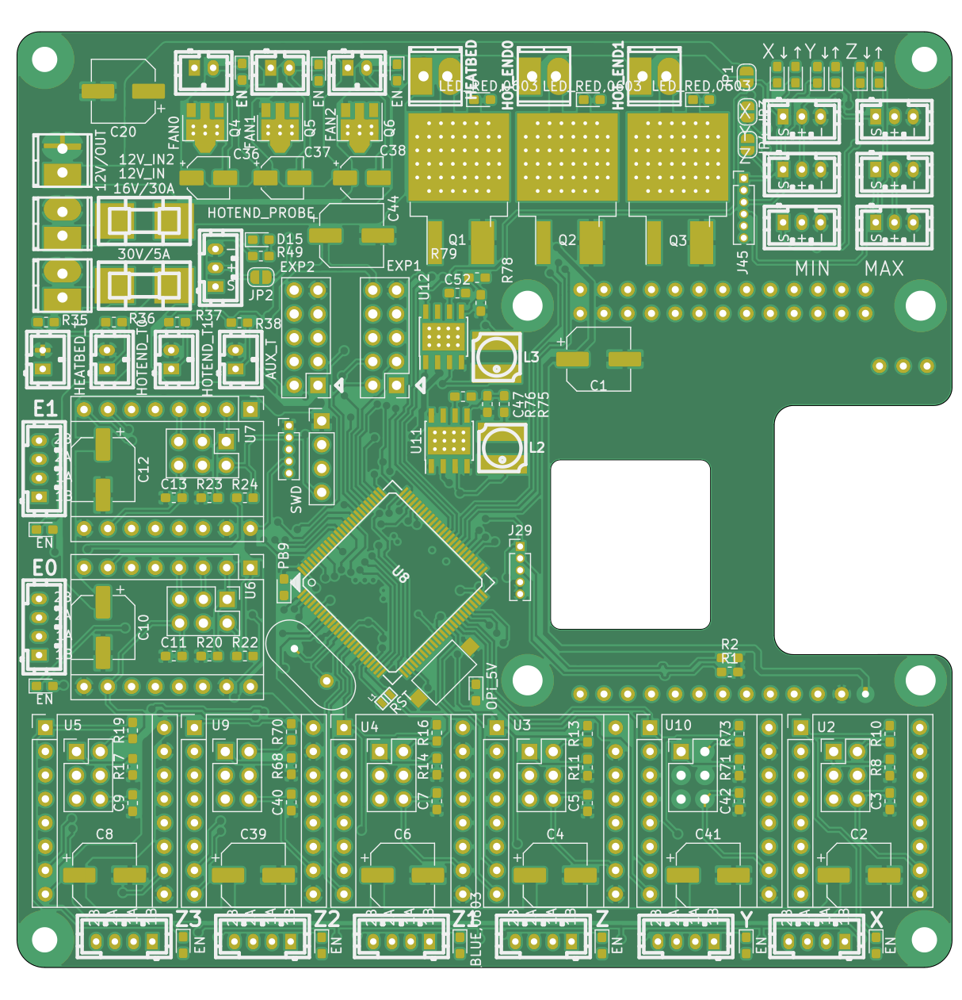
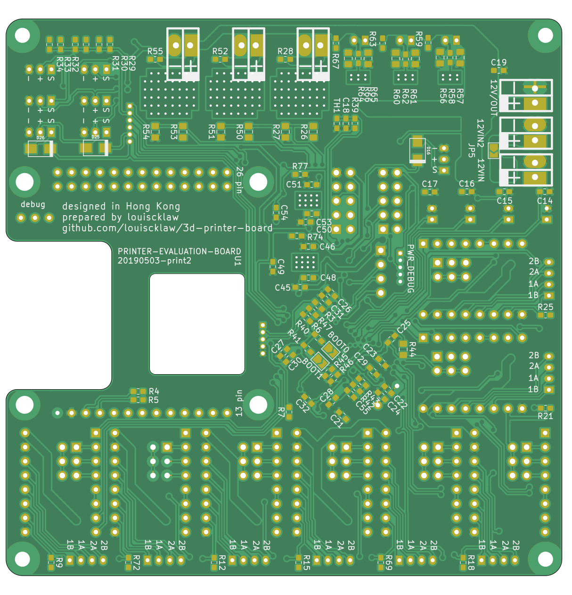

# Demo population manual

Lorem ipsum dolor sit amet, consectetuer adipiscing elit. Itaque earum rerum hic tenetur a sapiente delectus, ut aut reiciendis voluptatibus maiores alias consequatur aut perferendis doloribus asperiores repellat. Vestibulum fermentum tortor id mi. Nulla turpis magna, cursus sit amet, suscipit a, interdum id, felis.

####  This is the front side of the board we are populating

####  This is the back side of the board we are populating

####  First, populate RV1 and RV2. Basically, any description could be here.

####  Let's populate U2!

You can put a paragraph of text between the population steps.

####  We can also populate a component on the other side

And this is the end of the demo.

